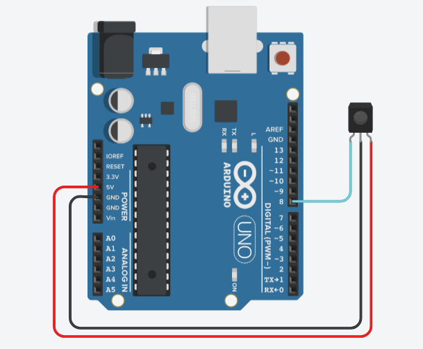

# Clonar Código Hexadecimal de Controle Remoto Usando Receptor IR.
Este código permite clonar código Hexadecimal das teclas de um controle remoto para usar nos projetos que requer controle via controle remoto.

**⚙️Modelos de receptor infravermelho:**
- VS1838B
- TSOP4838
- TSOP4830
- TL1838
- Ademais verificar a pinagem.

**⚙️Pinagem (verificar o modelo):**
- 1- DADOS (ligado a GPIO da placa Arduino ou esp32).
- 2- GND (ligado ao negativo/terra).
- 3- VCC (ligado a alimentação de 3 a 5 volts).

⚠️Seguir o esquema de montagem de acordo com o modelo do receptor infravermelho e conectar o pino de DADOS na GPIO escolhida no Arduino ou/e Esp32.

🗂️**Bibliotecas utilizadas:**
- 📁IRremote - [version 3.6.1⬇️](https://github.com/Arduino-IRremote/Arduino-IRremote)
