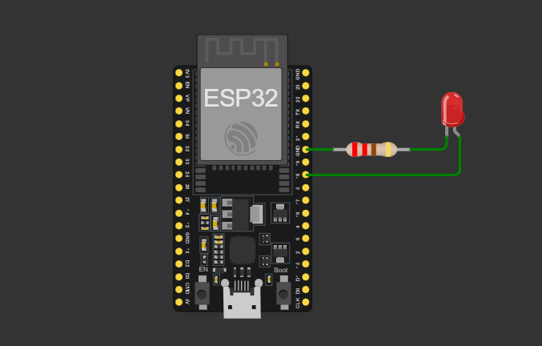

## Olá Mundo 

O olá mundo é o primeiro código que deve ser escrito quando se inicia uma nova linguagem de programação, e com os microcontroladores não é diferente, só que ao invés de imprimir uma mensagem, faz piscar um led. 

Abaixo segue o esquema de ligação, o positivo do LED (Anodo) é ligado na porta 18 do ESP32 e o negativo (Catodo) é ligado em serie com um resitor de 220 ohms ao negativo da placa (GND).

### Esquema de Ligação



### Código Fonte
```cpp
#include <Arduino.h> // Inclui a biblioteca do Arduino

int LED = 18; // Define a porta 18 do esp para ligar o LED.

// Função para configuração do esp32
void setup(){
  pinMode(LED, OUTPUT); // Configura a porta como saída
}

// Função do loop principal
void loop(){
digitalWrite(LED, HIGH); // Liga o LED
delay(1000);  // Espera 1 segundo
digitalWrite(LED, LOW); // Desliga o LED
delay(1000); //Espera 1 segundo
}
```
