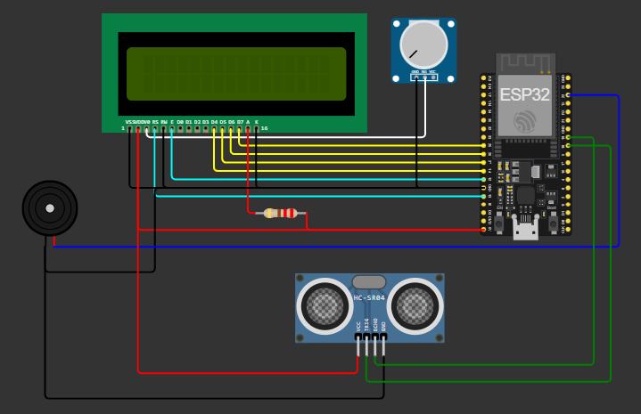

## Circuito Sensor Ultrassonic (Medir Distância) com display 16x2

### Esquema de ligação


### Código Fonte
```cpp
#include <Arduino.h>
#include <LiquidCrystal.h> // Biblioteca para o display LCD

// Pinagem
const int buzz = 22;
const int triggerPin = 18; // Pino TRIG do sensor ultrassônico
const int echoPin = 19;    // Pino ECHO do sensor ultrassônico

// Variáveis
long tempo;            // Para armazenar o tempo de ida e volta do sinal em microssegundos
float distancia_cm;    // Para armazenar a distância em centímetros
float distancia_in;    // Para armazenar a distância em polegadas

// Inicialização do display LCD
LiquidCrystal lcd(13, 12, 14, 27, 26, 25);

void setup() {
  pinMode(triggerPin, OUTPUT); // Configura pino TRIG como saída
  pinMode(buzz, OUTPUT);       // Configura pino do buzzer como saída

  // Deixa pino TRIG em LOW
  digitalWrite(triggerPin, LOW);
  delay(500);

  pinMode(echoPin, INPUT); // Configura pino ECHO como entrada
}

void loop() {
  // Disparar pulso ultrassônico
  digitalWrite(triggerPin, HIGH);
  delayMicroseconds(10);
  digitalWrite(triggerPin, LOW);

  // Medir tempo de ida e volta do pulso ultrassônico
  tempo = pulseIn(echoPin, HIGH);

  // Calcular as distâncias em centímetros e polegadas
  distancia_cm = tempo / 29.4 / 2;
  distancia_in = tempo / 74.7 / 2;

  // Apresentar resultados no display LCD
   lcd.begin(10, 4);
  lcd.setCursor(0, 0);
  lcd.print("Dist: ");
  lcd.print(distancia_cm);
  lcd.print(" cm");
  lcd.setCursor(0, 1);
  lcd.print("Pol: ");
  lcd.print(distancia_in);
  lcd.print(" in");

  // Verificar se a distância é menor ou igual a 100cm
  if (distancia_cm <= 100) {
    // Tocar o buzzer
    tone(buzz, 1000); // Frequência de 1000 Hz
  } else {
    // Desligar o buzzer
    noTone(buzz);
  }

  // Aguardar um pouco antes de começar tudo de novo
  delay(500);
}


```
